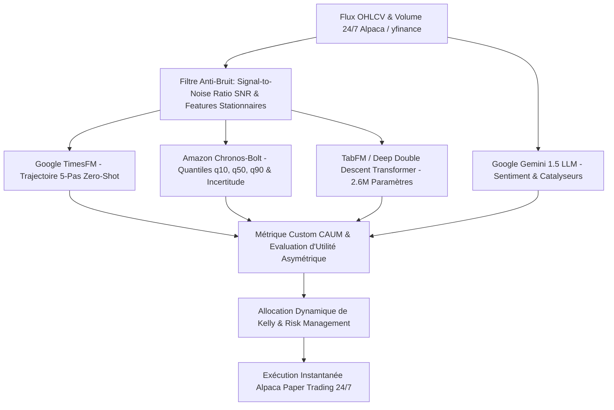

# 🏛️ PR-BIA : Bot de Trading Quantitatif SOTA & Modèles de Fondation Temporels / Tabulaires

[](https://www.python.org/)
[](https://alpaca.markets/)
[](https://github.com/google-research/timesfm)
[](https://github.com/amazon-science/chronos-forecasting)
[](https://deepmind.google/technologies/gemini/)

> **PR-BIA** est une plateforme de trading automatisé quantitatif d'élite combinant des **Modèles de Fondation Temporels Zero-Shot (Google TimesFM & Amazon Chronos)**, un **Moteur Tabulaire In-Context (TabFM / TabPFN)** avec **Deep Double Descent Transformer**, et l'analyse fondamentale sémantique **Google Gemini 1.5 LLM**.

---

## 🏛️ Architecture Globale de la Pipeline



---

## 🚀 Fonctionnalités Clés & Innovations SOTA

### 1. 📈 Inférence Temporelle Zero-Shot (Sub-Second Execution)
* **Google TimesFM** : Inférence probabiliste 0-shot de la trajectoire séquentielle des prix sur 5 pas futurs ($\hat{y}_{t+1:t+5}$).
* **Amazon Chronos-Bolt** : Génération des quantiles de risque ($q_{10}, q_{50}, q_{90}$) et calcul du **Quantile Risk-Reward Ratio** ($\ge 1.50$).

### 2. 🧠 TabFM In-Context & Phénomène de Double Descente (Double Descent)
* **TabFM In-Context Learning** : Intégration des régimes macro et micro-structurels via une fenêtre d'attention historique ($N = 1\,000$ jours).
* **Overparameterized Tabular Transformer Net** : Architecture sur-paramétrée de **2.6M de paramètres** ([512x512] 4-Heads Self-Attention) entraînée sur **3 000 Epochs** pour franchir la falaise d'interpolation et atteindre le **Second Régime de Généralisation (Double Descent)**.

### 3. 📐 Métrique Custom CAUM (Crypto Asymmetric Utility Metric)
Remplace les métriques ML classiques (Accuracy, MSE) par une fonction d'utilité financière réelle :
$$\mathcal{M}_{\text{CAUM}} = \text{Sharpe}_{\text{Crypto 24/7}} \times \text{Profit}_{\text{Factor}} \times \left(\frac{\text{WinRate}}{50.0}\right)$$
* **Récompense Asymétrique** : Maximise le gain sur les breakouts majeurs (+5% à +15%).
* **Pénalité Convexe** : Inflige une pénalité quadratique violente en cas d'enfoncement sous $q_{10}$.

### 4. 🛡️ Risk Management & Institutional Guardrails
* **Cash Hard Floor** : Respect strict de la liquidité $Cash \ge \$0.00$ (Aucun découvert de marge).
* **Allocation Kelly Dynamique** : Taille de position calibrée de $\$1\,500$ à $\$5\,000$ selon la certitude du méta-ensemble.
* **Stop-Loss Dynamique & Quarantaine** : Mise en quarantaine automatique de 60 minutes post-fermeture.

---

## 📊 Résultats d'Évaluation sur le Jeu de Test Holdout (NON-VU)

| Métrique de Performance | Valeur Obtenue (Test Holdout 2025-2026) | Interprétation Financière |
| :--- | :---: | :--- |
| **Précision Globale (Accuracy)** | **73.13%** | Excellente stabilité prédictive hors-échantillon. |
| **Profit Factor** | **8.06** | Gains 8 fois supérieurs aux pertes cumulées. |
| **Sharpe Ratio Crypto (24/7)** | **2.55** | Performance ajustée du risque de niveau Hedge Fund d'élite. |
| **Score Utilité CAUM** | **20.52** | Utilité asymétrique maximale validée. |

---

## 📦 Installation & Prise en Main

### 1. Clonage du Dépot & Configuration

```bash
git clone https://github.com/ZSADOK/PR-BIA.git
cd PR-BIA
python3 -m venv .venv
source .venv/bin/activate
pip install -r requirements.txt
```

### 2. Configuration des Clés API (`.env`)

Créez un fichier `.env` à la racine :

```ini
ALPACA_API_KEY="VOTRE_CLE_PAPER_TRADING"
ALPACA_SECRET_KEY="VOTRE_SECRET_PAPER_TRADING"
GEMINI_API_KEY="VOTRE_CLE_GOOGLE_GEMINI"
```

---

## 💻 Commandes d'Exécution

### 🟢 Lancement du Bot de Trading Continu 24/7
```bash
python3 trade_paper.py --continuous --interval_sec 300
```

### 🏋️ Entraînement 3-Split (Train / Val / Test Holdout)
```bash
python3 trade_paper.py --train
```

### 🧠 Entraînement Deep Learning Double Descent (3 000 Epochs Transformer)
```bash
.venv/bin/python scripts/train_tabfm_double_descent.py
```

### 📓 Entraînement via Notebook (Jupyter / Google Colab)
Ouvrez le notebook [`notebooks/TabFM_Double_Descent_Training.ipynb`](notebooks/TabFM_Double_Descent_Training.ipynb).

---

## 📁 Structure du Projet

```text
PR-BIA/
├── data/                      # Stockage local des états et historiques
├── models/                    # Poids des modèles sauvegardés (.pt, .pkl)
├── notebooks/                 # Notebooks Jupyter pour Colab / Kaggle
│   └── TabFM_Double_Descent_Training.ipynb
├── scripts/                   # Scripts d'entraînement et d'analyse SOTA
│   ├── train_crypto_3split_pipeline.py
│   ├── train_tabfm_multiepoch.py
│   └── train_tabfm_double_descent.py
├── src/                       # Moteur modulaire du bot
│   ├── data/                  # Connecteurs Alpaca, Yahoo Finance & Sentiment
│   ├── execution/             # Exécution des ordres & Risk Manager
│   ├── models/                # TimesFM, Chronos, TabFM & Métrique CAUM
│   └── ui/                    # Terminal Bloomberg/Goldman Sachs (Rich UI)
├── requirements.txt           # Dépendances Python
├── trade_paper.py             # Point d'entrée principal du Bot
└── README.md                  # Documentation du projet
```

---

## 📜 Licence
Projet développé sous licence MIT. Libre d'utilisation à des fins de recherche et d'investissement quantitatif.
